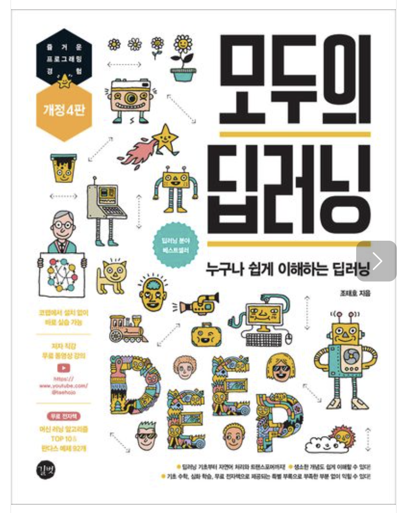

## 📝 소개

'인공지능 언어 모델 LLM의 모든 것' 수업 정리입니다.

 
## 🛠️ 학습 및 개발 환경

- Language: Python 3.13
- Enviroment: Anaconda
- IDE: Jupyter Notebook

 
## 📖 사용 교재

 
## ⚠️ 주의사항 및 참고 사항
- 본 저장소의 코드는 강의(김상모 강사님) 수업 내용과 교재를 바탕으로 작성 및 정리된 코드입니다.
- 일부 실습에 필요한 외부 데이터셋 및 모델 파일(`yoloweights`, `glove.6B` 등)은 용량 문제로 Git에 직접 올려두지 않았습니다.
- 해당 파일들은 아래 경로에서 직접 다운로드받아 각 폴더 위치에 넣은 후 실행해야 합니다.   
  - https://drive.google.com/drive/folders/12LsZ9jOhailndyM_328YbfNBO2rMBWpW   
  - https://drive.google.com/file/d/1Tl_sW6-ErJ4OQGu5kstr0Shwm9nfJJWY/view?usp=sharing   
  - https://nlp.stanford.edu/projects/glove/   
  - glove.6B.zip으로 다운!
